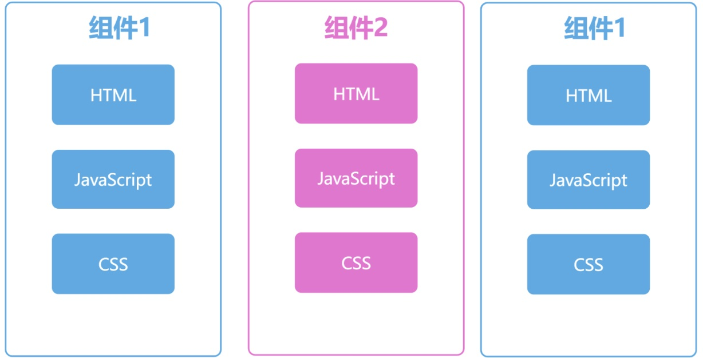
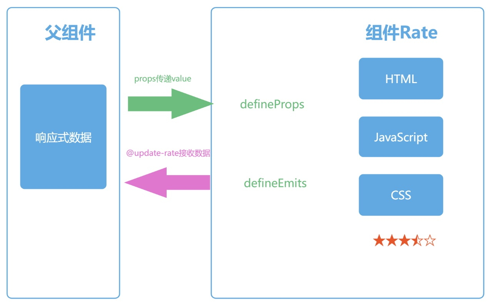

# mydoc

组件化开发


父子组件数据传递


## 创建项目

1. 创建mydoc项目
   
   ```bash
   npm create vite@latest mydoc
   ```

2. 安装vue-router, vuex模块
   
   ```bash
   npm install vue-router@next vuex@next
   ```

特性:
1. defineProps, defineEmits 实现组件间数据、事件传递
2. 自定义组件子元素的显示<slot></slot>
  src/pages/home.vue
  src/components/rate*.vue
